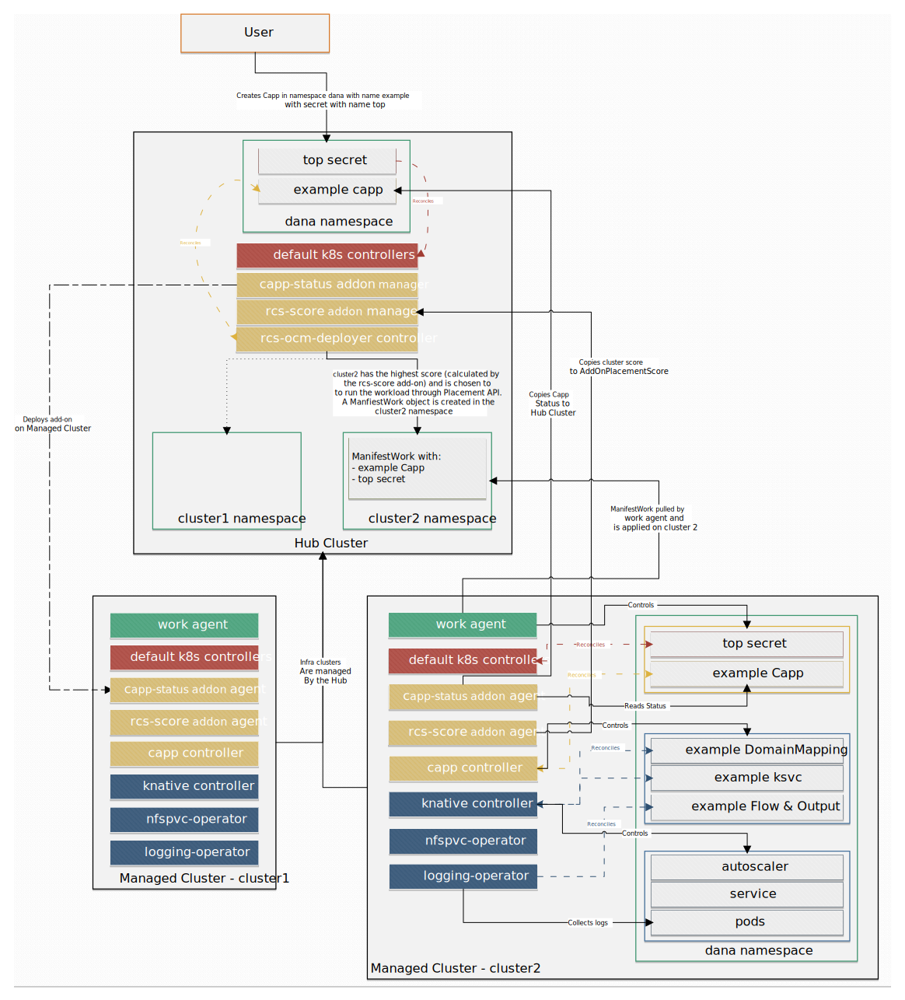

# rcs-ocm-deployer

`rcs-ocm-deployer` is an operator designed to deploy `Capp` (ContainerApp) workloads created on the Hub Cluster on the most suitable Managed Cluster using `OCM` (Open Cluster Management) APIs of `Placement` and `ManifestWork`. It also includes a `OCM AddOn` to sync the status of `Capp` between the Managed Clusters and the Hub Cluster.

## RCS

`RCS` (Run Container Service) is an open-source implementation of Container as a Service solution.

It utilizes the `OCM` project to create and manage workloads across multiple clusters, providing cloud-like features and technologies to users running on-premise.

It offers an auto cluster scheduler based on cluster usage and availability, requires basic configuration, and provides an auto-scaler template based on a single metric, among other features.

`RCS` aims to simplify and streamline the management of containerized applications, making it easier for developers to focus on writing code.

## Capp

This operator works together with the `container-app-operator`. For more information about `Capp` and about its API, please check [the Capp repo](https://github.com/dana-team/container-app-operator).

## Open Cluster Management

This project uses the `Placement` and `ManifestWork` APIs of the Open Cluster Management (OCM) project. For more information please refer to the [OCM documentation](https://open-cluster-management.io/concepts/).

## High-level architecture



1. The client creates the `Capp` CR in a Namespace on the Hub Cluster.

2. The `rcs-ocm-deployer` controller on Hub Cluster watches for `Capp` CRs and reconciles them.

3. The controller chooses the Managed Cluster with the highest score to deploy the `Capp` workload using the `Placement` API. The score is computed by the `rcs-score` addon which creates an `AddOnPlacementScore`.

4. Each Managed Cluster on the Hub Cluster has a dedicated namespace. The controller creates a `ManifestWork` object on the Hub Cluster in the namespace of the chosen Managed Cluster.

5. The Managed Cluster pulls the `ManifestWork` from the Hub Cluster using the `work agent` and creates a `Capp` CR on the Managed Cluster.

6. A `Capp` controller runs on Managed Cluster, watches for `Capp` CRs and reconciles them.

7. A status is returned from the Managed Cluster to the Hub Cluster using an `OCM AddOn`.

### The controllers

1. `placement`: The controller adds an annotation containing the chosen Managed Cluster to deploy the `Capp` workload on, in accordance to the `placementDecision` and the desired `Site`.

2. `sync`: The controller controls the lifecycle of the `ManifestWork` CR in the namespace of the chosen Managed Cluster. The `ManifestWork` contains the `Capp` CR as well as all the `Secrets` and `Volumes` referenced in the `Capp` CR, thus making sure that all the `Secrets` and `Volumes` also exist on the Managed Cluster, in the same namespace the `Capp CR` exists in on the Hub Cluster.

3. `addOns`: 
    - `status addon`: By applying this add-on to the Hub Cluster, the `Capp` status will automatically be synced back from Managed/Spoke Clusters to the Hub cluster. It has two components:
      - `agent` - deployed on the Managed/Spoke clusters; responsible for syncing the `Capp` status between the Managed Cluster and the Hub Cluster.
      - `manager` - deployed on the Hub Cluster; responsible for deploying the `agent` on the Managed/Spoke clusters.
    - `score addon`: Based on the [resource-usage-collect-addon](https://github.com/open-cluster-management-io/addon-contrib/tree/main/resource-usage-collect-addon), this add-on implements an  `AddonPlacementScore` which gives a score to each Managed Cluster. The score is in the range of [-100, 100] and is computed from collecting resource usage information (CPU Request and Memory Request).

## Getting Started

### Prerequisites

The following should be installed on your Linux machine:

- [`KinD`](https://kind.sigs.k8s.io/docs/user/quick-start/)
- [`docker`](https://docs.docker.com/engine/install/)
- [`clusteradm`](https://github.com/open-cluster-management-io/clusteradm)
- [`kubectl`](https://kubernetes.io/docs/tasks/tools/install-kubectl-linux/)

### Automatic Approach

Simply run the following to get a Hub cluster ready to have `rcs-ocm-deployer` deployed on it, and 2 Managed Cluster with `container-app-operator` already installed on them, with all add-ons installed as well.

```bash
$ make local-quickstart IMG=ghcr.io/dana-team/rcs-ocm-deployer:<release>
```

### Manual Approach

#### Setting Up a Hub Cluster and Managed Clusters locally

The [OCM project](https://github.com/open-cluster-management-io/OCM) contains a script that allows spinning up a `KinD`-based environment, containing of a Hub Cluster and 2 Managed Clusters.

##### The script

You can clone the repository and set up the environment. This script would create 3 clusters with the following Kubernetes contexts:

- `kind-hub`
- `kind-cluster1`
- `kind-cluster2`

To switch between contexts, use:

```bash
 $ kubectl config use-context <context-name>
```

Run the script:

```bash
$ git clone https://github.com/open-cluster-management-io/OCM
$ bash ./OCM/solutions/setup-dev-environment/local-up.sh
```

#### Create ManagedClusterSet

`ManagedClusterSet` is an [OCM cluster-scoped API](https://open-cluster-management.io/concepts/managedclusterset/) in the Hub Cluster for grouping a few managed clusters into a "set".

To create a `ManagedClusterSet`, run the following command on the Hub Cluster:

```bash
$ clusteradm create clusterset <clusterSet-name>
```

To add a Managed Cluster to the `ManagedClusterSet`, run the following command on the Hub Cluster:

```bash
$ clusteradm clusterset set <clusterSet-name> --clusters <cluster-name>
```

To bind the cluster set to a namespace, run the following command on the Hub Cluster:

```bash
$ clusteradm clusterset bind <clusterSet-name> --namespace <clusterSet-namespace>
```

#### Create Placement

For the controller to work, it is needed to create a `Placement` CR. This `Placement` selects all clusters and is used to install the [`addons`](#deploy-the-add-ons) on all the Managed Clusters:

```yaml
apiVersion: cluster.open-cluster-management.io/v1beta1
kind: Placement
metadata:
  name: all-clusters
  namespace: <clusterSet-namespace>
spec:
  clusterSets:
    - <clusterSet-name>
```

You can also create a Placement such that the clusters are selected using the customized scores. This uses the `AddonPlacementScore` which is [deployed later](#score-add-on):

```yaml
apiVersion: cluster.open-cluster-management.io/v1beta1
kind: Placement
metadata:
  name: <placement-name>
  namespace: <clusterSet-namespace>
spec:
  numberOfClusters: 1
  clusterSets:
    - <clusterSet-name>
  prioritizerPolicy:
    mode: Exact
    configurations:
      - scoreCoordinate:
          type: AddOn
          addOn:
            resourceName: rcs-score
            scoreName: cpuAvailable
        weight: 1
```

#### Install the Capp CRD

The `Capp` CRD needs to be installed on the Hub Cluster:

```bash
$ git clone https://github.com/dana-team/container-app-operator
$ cd container-app-operator
$ make install
```

#### Install cert-manager

To use `rcs-ocm-deployer`, you need to have `cert-manager` installed on your cluster. Follow the [instruction here](https://cert-manager.io/docs/installation/).

#### Deploying the controller

```bash
$ make deploy IMG=ghcr.io/dana-team/rcs-ocm-deployer:<release>
```

#### Configuration Using RCSConfig CRD

The `rcs-ocm-deployer` operator utilizes the `RCSConfig` CRD to manage its configuration and deployment options.

An instance of the `RCSConfig` CRD named `rcs-config` should exist in the `rcs-deployer-system` namespace. This CRD instance contains the necessary configuration for the operator.

```bash
apiVersion: rcs.dana.io/v1alpha1
kind: RCSConfig
metadata:
  name: rcs-config
  namespace: rcs-deployer-system
spec:
  placements:
  - placement-1st
  - placement-2nd
  # Add more placement names as needed
  placementsNamespace: your-placements-namespace
```

Ensure that the spec section includes a list of `placements` and specifies the `placementsNamespace` as required for your setup.

### Deploy the add-ons

#### Status add-on

Deploy the add-on the `Hub` cluster:

```bash
$ make deploy-status-addon IMG=ghcr.io/dana-team/rcs-ocm-deployer:<release>
$ kubectl -n open-cluster-management get deploy

NAME                             READY   UP-TO-DATE   AVAILABLE   AGE
capp-status-addon   1/1     1            1           14s
```

Patch the `ClusterManagementAddon` CR of the status addon, called `capp-status` to add the created `Placement` to the add-on, so that it's deployed on all clusters.
```bash
$ kubectl patch clustermanagementaddon capp-status-addon --type merge -p '{"spec":{"installStrategy":{"type":"Placements","placements":[{"name":"all-clusters","namespace":"<clusterSet-namespace>"}]}}}'
```
The controller will automatically install the add-on `agent` on all Managed/Spoke Clusters. Validate the add-on agent is installed on a Managed/Spoke` cluster:

```bash
$ kubectl -n open-cluster-management-agent-addon get deploy

NAME                                    READY   UP-TO-DATE   AVAILABLE   AGE
capp-status-addon-agent    1/1     1            1           2m24s
```

You can also validate and check the status of the add-on on the Hub cluster:

```bash
$ kubectl -n <managed-cluster> get managedclusteraddon

NAME                                AVAILABLE   DEGRADED   PROGRESSING
capp-status-addon      True                   
```

#### Score add-on

Deploy the add-on the `Hub` cluster:

```bash
$ make deploy-score-addon IMG=ghcr.io/dana-team/rcs-ocm-deployer:<release>
```

Deploy the `AddOnDeploymentConfig` which uses `customizedVariables` to pass the `max` value and `min` value [of the customized scores](https://open-cluster-management.io/scenarios/extend-multicluster-scheduling-capabilities/) as environment variables to the add-on deployment on the Managed Clusters.

```yaml
apiVersion: addon.open-cluster-management.io/v1alpha1
kind: AddOnDeploymentConfig
metadata:
  name: rcs-score-deploy-config
  namespace: open-cluster-management-hub
spec:
  agentInstallNamespace: open-cluster-management-agent-addon
  customizedVariables:
  - name: MAX_CPU_COUNT
    value: "<MAX_CPU_COUNT>"
  - name: MIN_CPU_COUNT
    value: "<MIN_CPU_COUNT>>"
  - name: MAX_MEMORY_BYTES
    value: "<MAX_MEMORY_BYTES>"
  - name: MIN_MEMORY_BYTES
    value: "<MIN_MEMEORY_BYTES>"
```

Patch the `ClusterManagementAddon` CR of the score, called `rcs-score` to add the created `Placement` and `AddonDeploymentConfigs` to the add-on, so that it's deployed on all clusters in the `Placement` with the default configuration.

```bash
kubectl patch clustermanagementaddon rcs-score --type merge -p \
'{"spec":{"installStrategy":{"type":"Placements","placements":[{"name":"<placement-name>","namespace":"<clusterSet-namespace>","configs":[{"group":"addon.open-cluster-management.io","resource":"addondeploymentconfigs","name":"rcs-score-deploy-config","namespace":"open-cluster-management-hub"}]}]}}}'
```

### Build your own image

```bash
$ make docker-build docker-push IMG=<registry>/rcs-ocm-deployer:<tag>
```

### Capp example

```yaml
apiVersion: rcs.dana.io/v1alpha1
kind: Capp
metadata:
  name: capp-sample
  namespace: capp-sample
spec:
  configurationSpec:
    template:
      spec:
        containers:
          - env:
              - name: APP_NAME
                value: capp-env-var
            image: 'quay.io/danateamorg/example-python-app:v1-flask'
            name: capp-sample
            volumeMounts:
              - name: testpvc
                mountPath: /data
        volumes:
          - name: testpvc
            persistentVolumeClaim:
              claimName: nfspvc
              readOnly: false
  routeSpec:
    hostname: capp.dev
    tlsEnabled: true
    tlsSecret: cappTlsSecretName
  volumesSpec:
    nfsVolumes:
      - server: test
        path: /test
        name: nfspvc
        capacity:
          storage: 200Gi
  logSpec:
    type: elastic
    host: 10.11.12.13
    index: main
    username: elastic
    passwordSecretName: es-elastic-user
    sslVerify: false
  scaleMetric: concurrency
  state: enabled
```
